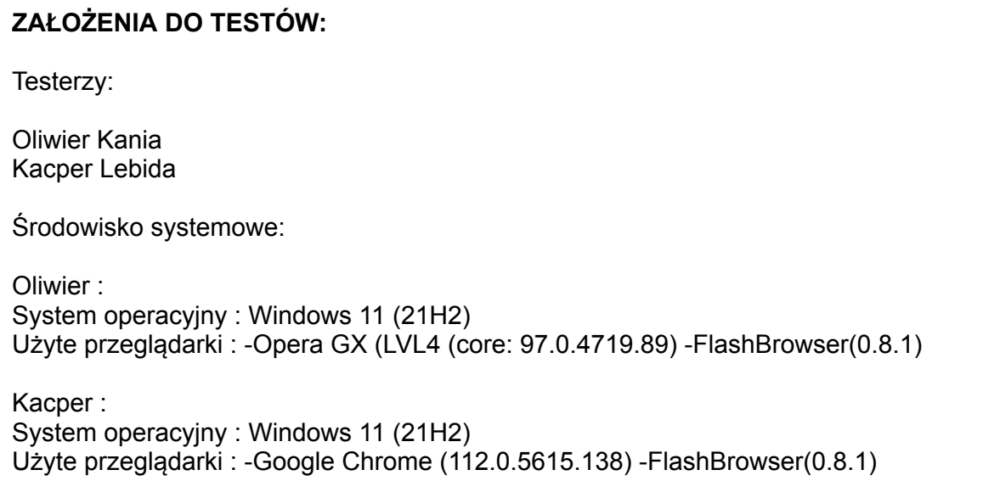
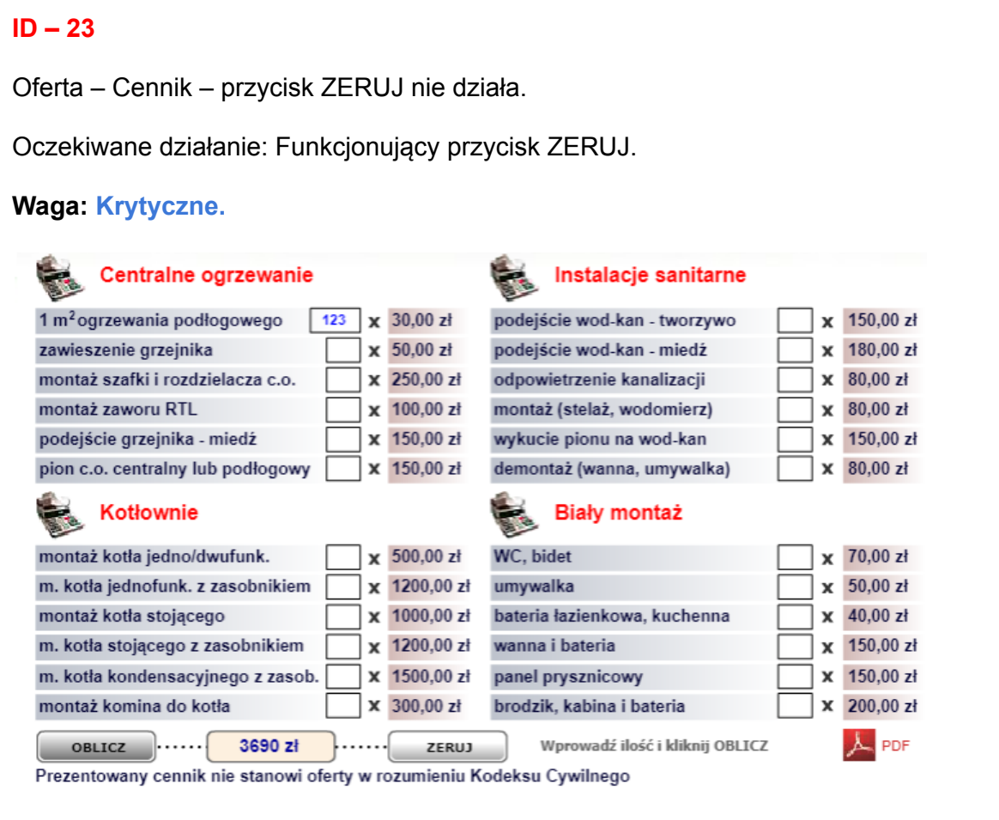
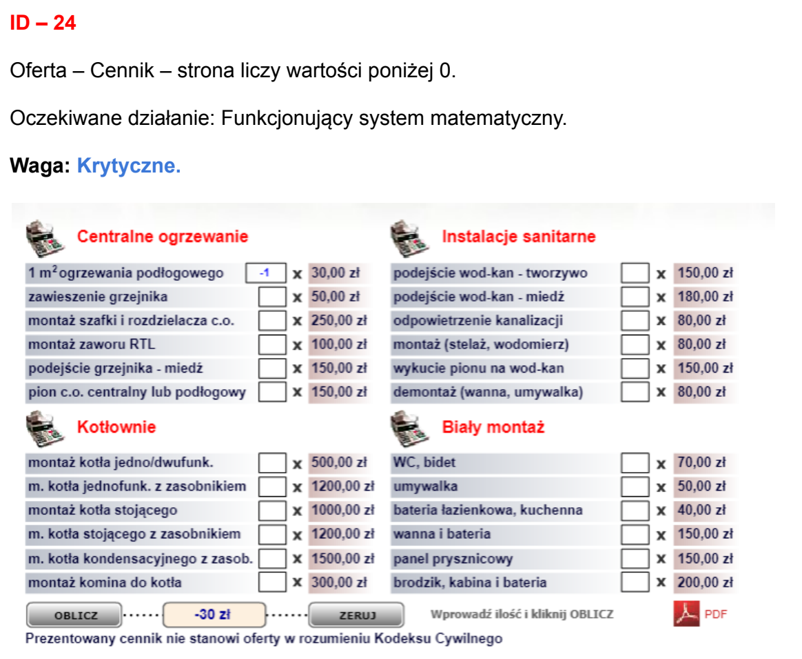
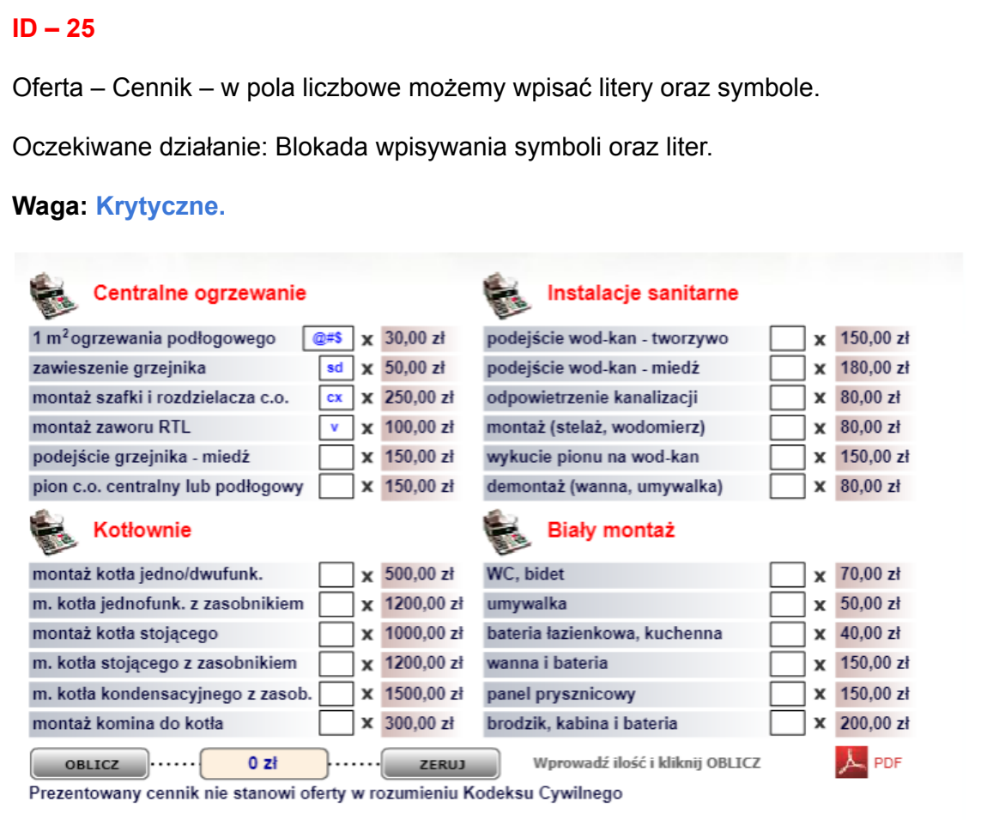

# Freelance QA - Black-box Web Testing

Manual functional, usability and browser-compatibility testing carried out by **Kacper Lebida and Oliwier** during my freelance QA work in **2023-2024**. This case study presents an anonymized example from our original 166-page report, which references testing in 2023.

## Evidence of our work

The report's first page names both testers and records our environments. Selected original report excerpts are included here, with client-identifying headings and contact details excluded.

**[Read the anonymized report excerpts (4 pages)](anonymized-report-excerpts.pdf)**

This is a joint report: I contributed to the testing and reporting alongside Oliwier. Individual findings are attributed to the joint report.

## Scope and approach

We tested the externally visible behavior of a legacy business website: navigation, interactive controls, a price calculator, page layout and content availability across browsers. We varied inputs and compared actual behavior with expected user-facing results. This was **black-box testing**; we assessed user-facing behavior.

The report separates testing with a Flash-capable browser from testing in contemporary browsers. It also contains an additional HTML-validator review and modernization recommendations; those activities are distinct from the behavioral black-box findings shown here.

| Tester | OS recorded in the report | Browsers recorded in the report |
| --- | --- | --- |
| Kacper Lebida | Windows 11, 21H2 | Chrome 112.0.5615.138; FlashBrowser 0.8.1 |
| Oliwier | Windows 11, 21H2 | Opera GX core 97.0.4719.89; FlashBrowser 0.8.1 |

These environments describe the original engagement.

## Selected findings

The steps below reconstruct the scenarios from the original descriptions and screenshots. The original report labels these findings critical; the portfolio assessments below explain impact more narrowly. Priority and later fix status are unknown.

### BB-01 - Reset does not clear the calculator

**Source:** page 26, Flash section, ID 23.

1. Open the price calculator in the tested Flash-capable environment.
2. Enter a quantity, then calculate the total.
3. Activate `ZERUJ` (Reset).

**Expected:** entered quantities and the calculated result return to their initial state.

**Reported actual:** Reset does not work. The screenshot shows quantity `123` and total `3690 zl`. The written report records the failed reset action.

**Impact:** users cannot reliably clear the form and may reuse stale values. Suggested severity: medium.

### BB-02 - A negative quantity produces a negative quote

**Source:** page 27, Flash section, ID 24.

1. Open the price calculator.
2. Enter `-1` for an item with a displayed unit price of `30 zl`.
3. Activate `OBLICZ` (Calculate).

**Expected:** reject a negative service quantity and provide a clear validation message.

**Observed in the source:** quantity `-1` is accepted and the displayed total is `-30 zl`.

**Impact:** the calculator generates a nonsensical estimate from invalid input. Suggested severity: medium.

### BB-03 - Quantity fields accept letters and symbols

**Source:** page 28, Flash section, ID 25.

1. Open the price calculator.
2. Enter letters and symbols into quantity fields.
3. Attempt to calculate the result.

**Expected:** only valid quantities are used; invalid entries receive clear feedback.

**Observed in the source:** fields contain letters and symbols while the displayed total is `0 zl`. The report flags missing input restrictions.

**Impact:** invalid input can be mistaken for a valid zero-cost estimate. Suggested severity: medium.

## Deliverable and limitations

Our deliverable was a report documenting actual/expected behavior, severity labels, screenshots, browser differences and improvement recommendations. The 166-page length is not a count of unique defects: identifiers restart between sections and some entries repeat. No claim is made that the client implemented recommendations or that the reported defects exist today.

The public PDF contains only selected flattened excerpts. Client-identifying details are excluded; authors and test environments are retained.
