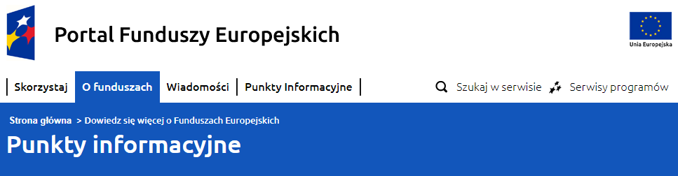

# Web Testing Case Study

A historical manual-testing case study based on a team report for the European Funds website, dated **17 June 2022**. **Kacper Lebida** is listed as one of nine testers.

## Scope and environment

The report covers navigation, search and filtering, feedback forms, responsive layout and other site interactions. It describes functional, usability and boundary-value testing.

My recorded environment was Windows 11 build 22000.675 and Chrome 102.0.5005.115. These versions identify the historical test context; the reported findings have not been rechecked against the current website.

## Contribution and attribution

I participated in the team exercise. The report lists testers and their environments, but the extracted text does not reliably assign every defect to an individual. This repository therefore presents team findings and does not claim that I personally discovered all of them.

## Representative findings

The descriptions below are editorial summaries of the historical report. They are not fresh reproductions.

| Reference | Scenario | Reported actual result | Expected result |
| --- | --- | --- | --- |
| FORM-01 | Submit invalid feedback, correct the fields and submit again | The corrected form remained blocked | A valid submission can proceed after correction |
| SEARCH-01 | Navigate to a three-digit search-results page | Pagination numbers overlap | Page numbers remain readable |
| NAV-01 | Open the information-points section | A different navigation item is highlighted | The current section is highlighted |

The identifiers above are new editorial references. The source repeats some numeric IDs; they should not be mistaken for preserved tracker identifiers.

## What the review revealed

The report has useful actual/expected descriptions, environment details and visual evidence. To make it stronger for a recruiter, each selected case needs clear preconditions, numbered reproduction steps, an evidence reference and a reasoned severity assessment.

Some entries are usability suggestions rather than confirmed functional defects. Severity labels should be reviewed instead of copied mechanically. A modernized report should also distinguish severity from scheduling priority and avoid assuming that a delayed email is necessarily a defect without a delivery requirement.

## Evidence status

The report's text and the selected navigation screenshot below have been reviewed. Other findings remain text summaries without selected screenshot evidence in this package. No new requests, form submissions or tests were made against the live website. Personal contact details and other testers' machine specifications are omitted.

The next step is to establish my individual subset of work, then adapt selected cases with their original evidence and clear historical dates.

## NAV-01: historical navigation mismatch

**Precondition:** the 2022 report's website version, displaying the Information Points section.

**Review procedure reconstructed from the report:**
1. Navigate to Information Points (Punkty informacyjne).
2. Compare the page heading with the active item in the main navigation.
3. Record the visible active state.

**Observed in the original screenshot:** the heading reads Punkty informacyjne, while O funduszach is highlighted. **Expected:** the active navigation state should identify the displayed section. **Suggested severity:** minor usability issue because it can confuse orientation without demonstrating blocked access. Priority was not established.

This image is preserved unchanged from the team report of 17 June 2022. The steps and severity explanation are editorial reconstruction, not a newly executed test. The screenshot does not establish which individual tester found the issue. The English case study was adapted on 13 September 2026.
